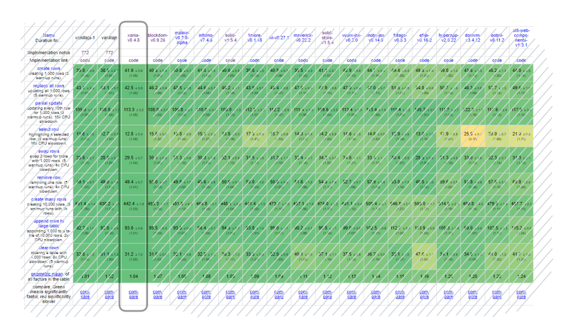

# @xania/view

Xania (package name '@xania/view') is **Fastest** JavaScript view library for building user interfaces

[](https://krausest.github.io/js-framework-benchmark/current.html#eyJmcmFtZXdvcmtzIjpbImtleWVkLzFtb3JlIiwia2V5ZWQvYWxwaW5lIiwia2V5ZWQvYW5ndWxhciIsImtleWVkL2FuZ3VsYXItbm96b25lIiwia2V5ZWQvYXBwcnVuIiwia2V5ZWQvYXJ0Iiwia2V5ZWQvYmRjIiwia2V5ZWQvYmxhem9yLXdhc20iLCJrZXllZC9ibGF6b3Itd2FzbS1hb3QiLCJrZXllZC9ibG9ja2RvbSIsImtleWVkL2JvYnJpbCIsImtleWVkL2Nob28iLCJrZXllZC9jcmFuayIsImtleWVkL2Rpb3h1cyIsImtleWVkL2Rvam8iLCJrZXllZC9kb21kaWZmIiwia2V5ZWQvZG9taW5hdG9yIiwia2V5ZWQvZG9tdm0iLCJrZXllZC9kb29odG1sIiwia2V5ZWQvZG96Iiwia2V5ZWQvZWYtanMiLCJrZXllZC9lbG0iLCJrZXllZC9lbWJlciIsImtleWVkL2VuZG9ycGhpbiIsImtleWVkL2ZudGFncyIsImtleWVkL2ZvcmdvIiwia2V5ZWQvZnJlIiwia2V5ZWQvZnVsbHdlYi1oZWxwZXJzIiwia2V5ZWQvZnVsbHdlYi10ZW1wbGF0ZSIsImtleWVkL2dsaW1tZXIiLCJrZXllZC9nbGltbWVyLTIiLCJrZXllZC9neXJvbiIsImtleWVkL2hlbGl4Iiwia2V5ZWQvaGVyZXN5Iiwia2V5ZWQvaHVsbG8iLCJrZXllZC9oeWRyby1qcyIsImtleWVkL2h5cGVyYXBwIiwia2V5ZWQvaW1iYSIsImtleWVkL2luZmVybm8iLCJrZXllZC9pdmkiLCJrZXllZC9qb3RhaSIsImtleWVkL2thcnlvbiIsImtleWVkL2tub2Nrb3V0Iiwia2V5ZWQva28tanN4Iiwia2V5ZWQvbGVwdG9zIiwia2V5ZWQvbGlnaHRlcmh0bWwiLCJrZXllZC9saXQiLCJrZXllZC9saXQtaHRtbCIsImtleWVkL2xzLWVsZW1lbnQiLCJrZXllZC9sdWkiLCJrZXllZC9sd2MiLCJrZXllZC9tYWhhbCIsImtleWVkL21hbGluYSIsImtleWVkL21hcmlvbmV0dGUiLCJrZXllZC9tYXJpb25ldHRlLWJhY2tib25lIiwia2V5ZWQvbWFya28iLCJrZXllZC9tYXZlcmljayIsImtleWVkL21pa2FkbyIsImtleWVkL21pbWJsIiwia2V5ZWQvbWlzbyIsImtleWVkL21pc29qcyIsImtleWVkL21pdGhyaWwiLCJrZXllZC9tb2J4LWpzeCIsImtleWVkL25ldmVybGFuZCIsImtleWVkL29sZHNrdWxsIiwia2V5ZWQvcHJlYWN0Iiwia2V5ZWQvcmFjdGl2ZSIsImtleWVkL3JheCIsImtleWVkL3JlYWN0Iiwia2V5ZWQvcmVhY3QtZGlhZ29uIiwia2V5ZWQvcmVhY3QtZm9jYWwiLCJrZXllZC9yZWFjdC1ob29rcyIsImtleWVkL3JlYWN0LWhvb2tzLXVzZS10cmFuc2l0aW9uIiwia2V5ZWQvcmVhY3QtbWx5biIsImtleWVkL3JlYWN0LW1vYlgiLCJrZXllZC9yZWFjdC1yZWNvaWwiLCJrZXllZC9yZWFjdC1yZWR1eCIsImtleWVkL3JlYWN0LXJlZHV4LWhvb2tzIiwia2V5ZWQvcmVhY3QtcmVkdXgtaG9va3MtaW1tdXRhYmxlIiwia2V5ZWQvcmVhY3QtcmVkdXgtcmVtYXRjaCIsImtleWVkL3JlYWN0LXJ4anMiLCJrZXllZC9yZWFjdC1zdGFyYmVhbSIsImtleWVkL3JlYWN0LXRhZ2dlZC1zdGF0ZSIsImtleWVkL3JlYWN0LXRyYWNrZWQiLCJrZXllZC9yZWFjdC16dXN0YW5kIiwia2V5ZWQvcmVhZ2VudCIsImtleWVkL3JlZG9tIiwia2V5ZWQvcmVmbGV4Iiwia2V5ZWQvcmVzY3JpcHQtcmVhY3QiLCJrZXllZC9yZXNvbmF0ZWpzIiwia2V5ZWQvcmlvdCIsImtleWVkL3MyIiwia2V5ZWQvc2FuIiwia2V5ZWQvc2FuLWNvbXBvc2l0aW9uIiwia2V5ZWQvc2FuLXN0b3JlIiwia2V5ZWQvc2NhcmxldHMtZnJhbWUiLCJrZXllZC9zaWZyciIsImtleWVkL3NpbnVvdXMiLCJrZXllZC9za3J1diIsImtleWVkL3NsZWRnZWhhbW1lciIsImtleWVkL3NvbGlkIiwia2V5ZWQvc29saWQtc3RvcmUiLCJrZXllZC9zcGFpciIsImtleWVkL3NwYWlyLXFyIiwia2V5ZWQvc3Rkd2ViIiwia2V5ZWQvc3RlbmNpbCIsImtleWVkL3N2ZWx0ZSIsImtleWVkL3N5Y2Ftb3JlIiwia2V5ZWQvdWRvbXNheSIsImtleWVkL3VodG1sIiwia2V5ZWQvdWh5ZHJvIiwia2V5ZWQvdWk1LXdlYmNvbXBvbmVudHMiLCJrZXllZC92YWx0aW8iLCJrZXllZC92YW5pbGxhanMiLCJrZXllZC92YW5pbGxhanMtMSIsImtleWVkL3ZhbmlsbGFqcy13YyIsImtleWVkL3ZvYnkiLCJrZXllZC92dWUiLCJrZXllZC92dWVyeC1qc3giLCJrZXllZC93YXNtLWJpbmRnZW4iLCJrZXllZC93aGF0c3VwIiwia2V5ZWQveGFuaWEiLCJrZXllZC95ZXciLCJrZXllZC95ZXctaG9va3MiLCJub24ta2V5ZWQvYXBwcnVuIiwibm9uLWtleWVkL2FydCIsIm5vbi1rZXllZC9hdXJlbGlhIiwibm9uLWtleWVkL2JkYyIsIm5vbi1rZXllZC9iaW5kaW5nLnNjYWxhIiwibm9uLWtleWVkL2RlbG9yZWFuIiwibm9uLWtleWVkL2Rvam8iLCJub24ta2V5ZWQvZG9tZGlmZiIsIm5vbi1rZXllZC9kb212bSIsIm5vbi1rZXllZC9kb29odG1sIiwibm9uLWtleWVkL2RveiIsIm5vbi1rZXllZC9lZi1qcyIsIm5vbi1rZXllZC9lbG0iLCJub24ta2V5ZWQvZW5kb3JwaGluIiwibm9uLWtleWVkL2ZyZSIsIm5vbi1rZXllZC9neXJvbiIsIm5vbi1rZXllZC9oYWxvZ2VuIiwibm9uLWtleWVkL2hlcmVzeSIsIm5vbi1rZXllZC9odWxsbyIsIm5vbi1rZXllZC9oeWRyby1qcyIsIm5vbi1rZXllZC9pbWJhIiwibm9uLWtleWVkL2luZmVybm8iLCJub24ta2V5ZWQvbGVnZW5kLXN0YXRlIiwibm9uLWtleWVkL2xpZ2h0ZXJodG1sIiwibm9uLWtleWVkL2xpdCIsIm5vbi1rZXllZC9saXQtaHRtbCIsIm5vbi1rZXllZC9saXRlcmFsanMiLCJub24ta2V5ZWQvbWFxdWV0dGUiLCJub24ta2V5ZWQvbWlrYWRvIiwibm9uLWtleWVkL21pbGxpb24iLCJub24ta2V5ZWQvbWlsbGlvbi1yZWFjdCIsIm5vbi1rZXllZC9taW1ibCIsIm5vbi1rZXllZC9taXNvIiwibm9uLWtleWVkL25ldmVybGFuZCIsIm5vbi1rZXllZC9yYWN0aXZlIiwibm9uLWtleWVkL3JlYWN0Iiwibm9uLWtleWVkL3JlZG9tIiwibm9uLWtleWVkL3JlZmxleC1kb20iLCJub24ta2V5ZWQvcmlvdCIsIm5vbi1rZXllZC9zYW4iLCJub24ta2V5ZWQvc2F1cm9uIiwibm9uLWtleWVkL3NjYXJsZXRzLWZyYW1lIiwibm9uLWtleWVkL3NlZWQiLCJub24ta2V5ZWQvc2lmcnIiLCJub24ta2V5ZWQvc2xpbS1qcyIsIm5vbi1rZXllZC9zbGluZ2pzIiwibm9uLWtleWVkL3N0ZHdlYiIsIm5vbi1rZXllZC9zdmVsdGUiLCJub24ta2V5ZWQvdWRvbXNheSIsIm5vbi1rZXllZC91aHRtbCIsIm5vbi1rZXllZC91aTUtd2ViY29tcG9uZW50cyIsIm5vbi1rZXllZC92YW5pbGxhanMiLCJub24ta2V5ZWQvdmFuaWxsYWpzLTEiLCJub24ta2V5ZWQvdnVlIl0sImJlbmNobWFya3MiOlsiMDFfcnVuMWsiLCIwMl9yZXBsYWNlMWsiLCIwM191cGRhdGUxMHRoMWtfeDE2IiwiMDRfc2VsZWN0MWsiLCIwNV9zd2FwMWsiLCIwNl9yZW1vdmUtb25lLTFrIiwiMDdfY3JlYXRlMTBrIiwiMDhfY3JlYXRlMWstYWZ0ZXIxa194MiIsIjA5X2NsZWFyMWtfeDgiLCIyMV9yZWFkeS1tZW1vcnkiLCIyMl9ydW4tbWVtb3J5IiwiMjNfdXBkYXRlNS1tZW1vcnkiLCIyNV9ydW4tY2xlYXItbWVtb3J5IiwiMjZfcnVuLTEway1tZW1vcnkiLCIzMV9zdGFydHVwLWNpIiwiMzRfc3RhcnR1cC10b3RhbGJ5dGVzIl0sImRpc3BsYXlNb2RlIjoxLCJjYXRlZ29yaWVzIjpbXX0=)

#### Playground

https://stackblitz.com/edit/vitejs-vite-njpme2?file=src/App.tsx

#### Goal

Goal of _Xania_ is to 'fix' React. Keep using the good parts (JSX is king, unidirectional data flow) but prevent issues (stale closures) from happening so that we don't have to solve them.

Also, goal is to proof simple design is the best design:

- supports all primitives of the platform
- easy to understand and intuitive (for you to judge)
- being the fastest, literally (see [benchmark](https://krausest.github.io/js-framework-benchmark/2022/table_chrome_104_windows.html))

## Starting new project

```powershell
npm init @xania/app hello-world
```

```powershell
cd hello-world
npm start

VITE v3.2.4  ready in 150 ms
➜  Local:   http://localhost:3000/
```

## Existing project

1. install package

```powershell
npm i @xania/view
```

2. add jsx support through configuration in tsconfig.json

```json
/** /tsconfig.json */
{
  "compilerOptions": {
    ...
    "jsxFactory": "jsx.createElement",
    "jsx": "react",
    "jsxFragmentFactory": "jsx.createFragment",
    "typeRoots" : ["@xania/view/types"]
  }
}
```

3. Create components using the jsx syntax

```typescript
/* time.tsx */
import { jsxFactory } from "@xania/view"
const jsx = jsxFactory(/** factory options **/);

export function Time() {
  const state = useState("");
  setInterval(_ => state.update(new Date().toLocalTimeString(); ), 1000);
  return state;
}

```

4. Render to HTML

```typescript
/* app.tsx */
import { render } from '@xania/view';
import Time from './time';

render(<Time />, document.body);
```

### How is _Xania_ better than _React_?

##### 1. _Xania_ solves common issues.

Most of the issues in React are caused by the re-rendering of the component on state change. All these hooks have cascading issues, it's funny that some hooks are introduced to mitigate issues from other hooks and in the process introduce new issues.

- ~~useEffect~~
- ~~useCallback~~
- ~~useMemo~~
- ~~useRef~~
- ~~use~~
- ~~cache~~
- ...

So how can _Xania_ update the view without re-rendering? The solution is examined by _Xania_ is fine-grained reactivity and binding to state objects and observables.

##### 2. _Xania_ uses the platform

First class support for

- async/await
- promises
- observables (any object that implements `subscribe`)
- async iterators (design phase, see question)
- arrays (just like React)

Javascript is expressive and is getting better. While async/await was introduced in 2017, React still lacking bullet proof support for it (encountered by first use of `use` hook, unless you haven't used it already). Seeing this I don't dare dreaming of support of async iterators.

Observables support in _React_ is even worse, first read blog by Dan Abramov on useInterval, then take a look at `Clock` component in the [xania project](#starting-new-project)

##### Work in progress

- release 1.0
- universal code client and server
- integrations with astro, remix, next.js if possible?

##### Definitely keep JSX and component functions

```jsx
function MyComponent() {
   return <span>Hello, World<span>;
}

render(<MyComponent />, document.body);
```

##### Keep useState, but add full HTML syntax support, use click not onClick, class not className

```jsx
function MyComponent() {
  const count = useState(0);
  return (
    <button click={(_) => count.update((x) => x + 1)}>Count: {count}</button>
  );
}
```

##### `useState` with objects

```jsx
function MyComponent() {
   var me = useState({ firstName: "Ibrahim", lastName: "ben Salah"});
   return (
      <div>
         fullName: {me.get("firstName")} {me.get("lastName"})
      </div>
   )
}
```

##### True first class support for async/await and promises, not the fake `use` hook

```jsx
async function MyComponent() {
  const ditto = await fetchPokemon();
  return <div>{ditto.name}</div>;
}
```

##### Support for async iterator (experimental / work in progress)

Not sure if one would expect this to end up with one final div and auto dispose all the previous, or all div's should be retained

```jsx
async function* MyComponent() {
  for (const delay of this.delays) {
    await this.wait(delay);
    yield <div>`Delayed response for ${delay} milliseconds`</div>;
  }
}
```

##### Support for observables (e.g. rxjs)

```jsx
function MyCounter() {
  const time = timer(0, 1000).pipe(map(() => new Date()));
  return <div>Current time: {time}</div>;
}
```

#### References

Examples project:
https://github.com/xania/examples

benchmark code:
https://github.com/xania/krausest-js-benchmark
