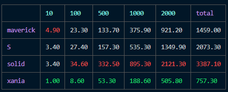
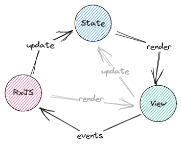



### State 

Is blazingly fast javascript library for managing reactive state.



> [Visit the docs website to learn more about how to use @xania/state in your project.](https://xania.github.io/state)

#### Getting started

```shell
npm install @xania/state
```

```typescript
import { State } from "@xania/state"

const a = new State(1);
const b = a.map(x => x + 1);
const c = a.map(x => x * 2);
const d = a.bind(x => x % 2 === ? b : c);
```

#### Motivation

_@xania/state_ is intended to be complementary to RxJS and is especially an alternative to BehaviorSubject and it's main goal to provide reactivity for the View library. RxJS is on the other hand better suited for handling events coming from view, e.g. for debounce, async, etc...

;

- Compatibility with RxJS, RxJS for events and scheduling, and xania for fine grained state.
- Side effects are hidden
- Side effects are idempotent
- (eventual) consistency between source state and observer state

#### fine-grained state

In realworld, a state is practically never isolated from other parts of the state. e.g. `firstName` can be represented by a state object but it is also part of the `Employee` state and the two and all there observers needs to be in sync. Most used pattern for updating `firstName` in other libraries use a coarse grained approach where the whole person updates is updates. Biggest disadvantage is that the handling of `firstName` gets entangled with the structure of `Person`, which also means that this affected by any changes in structure.

_@xania/state_ provides a different pattern using fine-grained approach. _@xania/state_ provides a `prop` method to create an isolated state object and uses (internal) operators to keep the parent en it's property in sync.

```typescript
const person = new State({
  firstName: 'Ibrahim',
});
const firstName = person.prop('firstName');
firstName.set('Ramy');

console.log(person.get().firstName); // prints 'Ramy'
```

1. we can create rxjs observables from state objects

```typescript
import * as Rx from 'rxjs';

const s = new State(1);
const x = Rx.from(s);
```

2. And we can connect rxjs back to state objects

```typescript
const x = Rx.timer(0, 1000);
const s = State.from(x);
```

#### Design and concepts

State objects encapsulate values and are responsible for synchronisation with derived state and derived state of derived state etc..

```typescript
new State(1).set(2);
```

##### Derived state

The are three core methods of creating a derived state.

- `prop`: property of a root object
- `map`: monadic map
- `bind`: monadic bind

##### State mutations

State mutation is done by calling `set` on root object. Derived states do not allow for direct mutations. Changes can only flow from root states with one exception, namely a property state mapped directly of a root state in which case we can guarantee consistency for all derived states.

##### Sync external mutations

Xania does not ignore the fact that we can mutate the state outside the _formal_ set operation. That's where `sync` comes into play.

```typescript
const data = {
  firstName: 'Ibrahim',
};
const person = new State(data);
const firstName = state.prop('firstName');
firstName.subscribe({
  next(x) {
    console.log('Hello, ', x);
  },
});
// console output: Hello, Ibrahim

// external mutation
data.firstName = 'Ramy';
sync(person);
// console output: Hello, Ramy
```

To maintain

#### Diamond problem

Xania ensures correct order in which the updates are propagated in a single roundtrip. This is especially important in case of the known diamond problem.

[live demo](https://stackblitz.com/edit/vitejs-vite-cxno2b?file=src%2FApp.tsx)

#### Features:

- monadic state (map, bind)
- topological sorting
- asynchronuous data (in progress)
- scheduling (in progress)
- batching (in progress)
